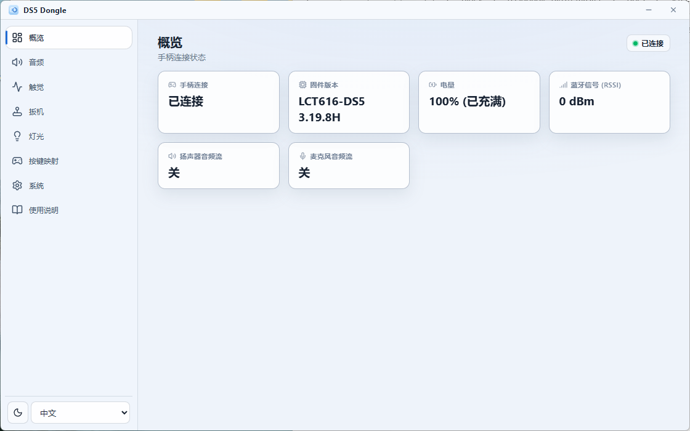
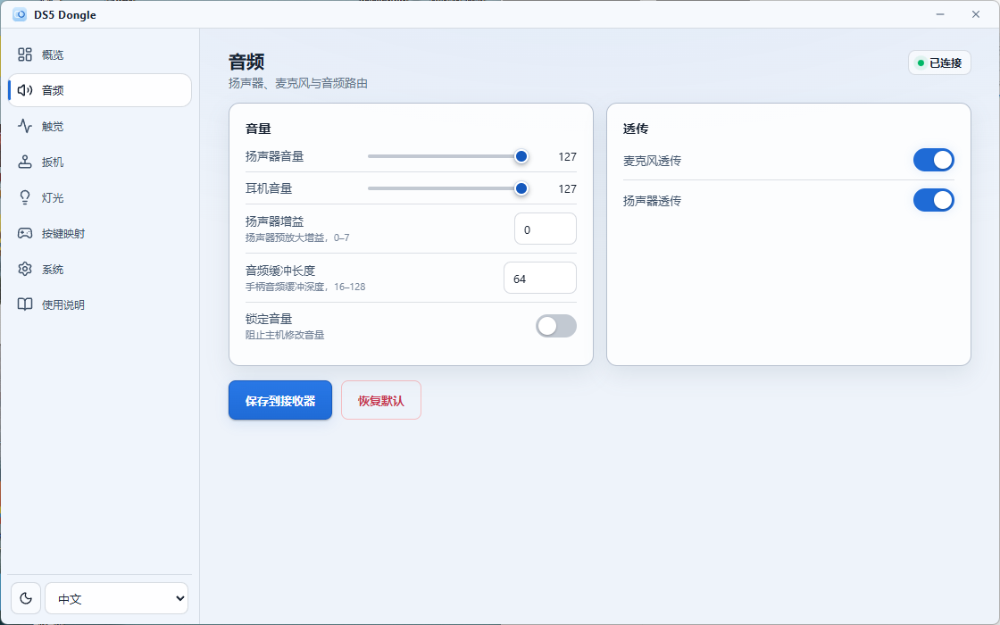
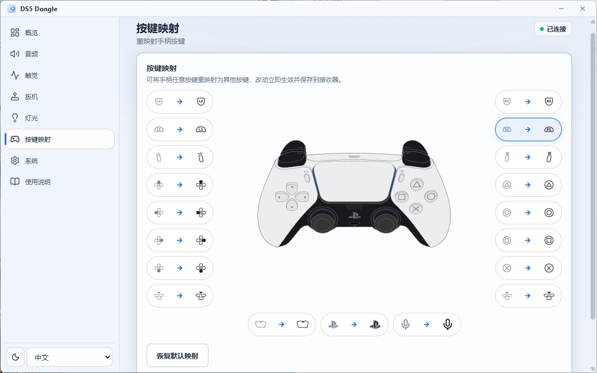
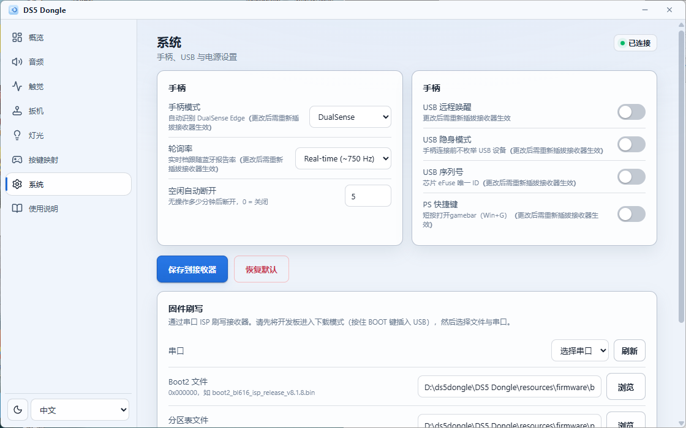

# DS5Dongle BL618（DS5 Dongle）

> **English**：[README_EN.md](README_EN.md)

基于 **LCTech BL616** 开发板的 DualSense 无线手柄适配器固件。将 DualSense / DualSense Edge 手柄通过蓝牙经典（BR/EDR）HID 连接到 BL616，再通过 USB HID 透传给主机，主机端呈现为标准有线 DualSense（VID 054C / PID 0CE6）或 DualSense Edge（PID 0DF2）。Steam、SDL、PS Remote Play 等均可直接识别。

> **非官方项目** —— 与索尼互动娱乐（Sony Interactive Entertainment）无关，亦未获其认可。"DualSense"、"DualSense Edge" 和 "PlayStation" 是索尼互动娱乐的商标。USB VID/PID（054C:0CE6 / 0DF2）仅用于模拟，使主机将其识别为有线手柄；使用风险自负。

> 本项目**仅适配 LCTech BL616 开发板**（固件源码中板级抽象 `board_config.h` 保留了其它板型的编译选项，但未在其它硬件上验证，请以 LCTech BL616 为准）。

## 硬件要求

- **LCTech BL616 开发板**（BL616 QFN32，Type-C 原生 USB + 板载 USB 转串口）
- **DualSense 手柄**（标准版 0CE6）或 **DualSense Edge**（0DF2，自动识别）
- USB-C 数据线（供电 + USB 数据）
- 串口调试（可选）：USB-TTL 适配器（CH340/CH341，3.3V）

## 功能特性

- BT Classic HID Host：Inquiry、SDP、L2CAP、SSP 自动配对
- 完整输入透传：摇杆、按键、扳机、陀螺仪、加速度计、触摸板、电量
- 完整输出透传：震动、RGB 灯条、玩家指示灯、自适应扳机
- 双向音频透传：UAC1 4ch 48kHz OUT → Opus 编码 → BT 0x39 双帧报告（547B，扬声器/耳机）；BT 麦克风 Opus → 解码 → UAC1 2ch 48kHz IN
- HD 触觉反馈：USB Audio Ch2/Ch3 → 16:1 降采样 → BT 0x92 触觉 tag
- DualSense Edge 支持：自动识别 → unlock 握手 → profile 预取，PID 自动切换（0DF2）
- 多手柄记忆：最多记忆 8 个已配对手柄，单击按键快速切换
- 稳健重连：周期性扫描重试、连接看门狗、链路监督超时、陈旧 ACL 清理
- 空闲超时：可配置 0–60 分钟自动断开（默认 30 分钟）
- PS 快捷键：短按 → Win+G，长按 → Win+Tab
- 轮询率可配置：250Hz / 500Hz / 实时档（~750Hz）
- 按键映射：任意按键重映射，含 **D-pad 四方向**（共 19 个可映射按键）
- USB 远程唤醒、USB 隐身模式、USB 序列号（eFuse）、扳机电机功率限制、音量锁定、LED 自动熄灭、电量告警
- 多语言伴生应用（Windows）：简体中文 / English，深色 / 浅色主题

### Windows 伴生应用（DS5 Dongle）

仓库 `companion/` 提供一个基于 Electron + React 的 **Windows 配置工具**，通过 HID Feature Report（0xF6–0xF9 / 0xFB）直接读写接收器配置，无需改固件：

- **配置页面**：音频（扬声器/耳机音量、增益、缓冲、透传开关）、触觉增益、扳机电机限流、灯条颜色、按键映射、系统（手柄模式 / 轮询率 / 空闲超时 / USB 唤醒 / 隐身 / PS 快捷键）
- **可视化按键映射**：原版 DualSense 手柄图 + 按键 glyph 图标，映射实时生效并持久化
- **固件刷写**：内置 BLFlashCommand + 默认固件（打包进安装包），无需 SDK 即可串口 ISP 刷写
- **状态监测**：手柄连接状态实时显示（断连自动检测），电量 / RSSI / 固件版本

**界面预览：**

<p align="center">
  
  <br><em>概览：连接状态 / 电量 / 信号 / 音频流</em>
</p>

<p align="center">
  
  <br><em>音频：扬声器 / 耳机音量、增益、透传开关</em>
</p>

<p align="center">
  
  <br><em>按键映射：手柄图 + glyph 图标，实时生效并持久化</em>
</p>

<p align="center">
  
  <br><em>系统：模式 / 轮询率 / USB / 固件刷写</em>
</p>

## 手柄功能兼容性

USB 端提供 DualSense 兼容的 HID 描述符（DS 与 Edge 自动切换），主机将其视为有线手柄。

| 功能 | 数据路径 | 支持 |
|------|----------|------|
| 摇杆 / 按键 / 扳机 | HID Input 透传 | 是 |
| 陀螺仪 / 加速度计 | HID Input 透传 | 是 |
| 触摸板 | HID Input 透传 | 是 |
| 电池电量 | HID Input 透传 | 是（另有板载 LED 低电量告警） |
| **自适应扳机** | HID Output SetStateData | 是 |
| **震动** | HID Output SetStateData | 是 |
| RGB 灯条 / 玩家指示灯 | HID Output SetStateData | 是 |
| **HD 触觉反馈** | USB Audio Ch2/Ch3 → BT 0x92 | 是 |
| 手柄扬声器 | USB Audio Ch0/Ch1 → Opus → BT 0x39 tag 0x93 | 是 |
| 手柄麦克风 | BT Input → Opus 解码 → USB Audio IN | 是 |
| 3.5mm 耳机（输出） | USB Audio → Opus → BT 0x39 tag 0x96 | 是 |
| 麦克风静音灯 | BT Input 静音键 → MuteLight 控制 | 是 |

## LED 状态指示（LCTech BL616 单颗蓝色 LED）

| 状态 | 模式（单颗蓝灯） |
|------|------------------|
| 空闲 / 等待配对 | 慢闪（~1Hz） |
| 扫描中 | 快闪（~3Hz） |
| 已连接 | 常亮 |
| 刚断开 | 闪烁（~1Hz）约 3 秒，随后回到空闲慢闪 |
| 电量 ≤20%（放电中） | 中速闪（~1.7Hz） |
| 电量 ≤10%（放电中） | 快闪（~3Hz） |
| 自动熄灭 | 1 分钟后熄灭（默认开启；电量告警不受影响） |
| 事件确认 | 闪一次 |
| 清除配对 | 连闪三次 |

### BOOT 按键手势

| 手势 | 功能 |
|------|------|
| **单击** | 切换到下一个已配对的手柄（最多记忆 8 个） |
| **双击** | 断开当前手柄 + 重新扫描配对新手柄（保留 link key） |
| **长按 3 秒** | 清除所有配对 + 重新扫描（三次蓝闪确认） |

## 快速开始

### 1. 安装 Bouffalo SDK（必须使用本项目分支）

```bash
git clone https://github.com/sqlCRT/bouffalo_sdk.git bouffalo_sdk
```

构建脚本要求 SDK 位于 `../bouffalo_sdk`（与本仓库同级目录）。

### 2. 安装依赖与工具链

- macOS/Linux：`brew install cmake make`（或 `apt install cmake make`）
- RISC-V 工具链需使用 **T-Head 扩展** 版本（标准 `riscv64-elf-gcc` 不可用），macOS 可用社区预编译工具链，Linux 用 SDK 自带或 T-Head 官方工具链
- Windows：T-Head Windows 工具链 + 仓库自带 `build_windows.bat`

### 3. 编译（LCTech BL616）

```bash
# macOS / Linux
bash build_macos.sh build      # 增量编译
bash build_macos.sh rebuild    # 清理后重新编译
bash build_lctech616.sh rebuild
```

```bat
rem Windows
build_windows.bat rebuild
```

产物位于 `firmware/lctech616/ds5dongle-lctech616.bin`（约 800KB），以及 boot2/partition 文件和 `flash_prog_cfg.ini`。

## 刷写方式

LCTech BL616 支持两种刷写方式：

**方式一：Dev Cube（UART/ISP 模式）**

1. 先完成编译，构建脚本会把 `ds5dongle-lctech616.bin`、`boot2_bl616_isp_release_v8.1.8.bin` 和 `partition_cfg_4M_nosec.toml` 输出到 `firmware/lctech616/`
2. 按住 LCTech BL616 的 **BOOT** 键，然后通过 USB-C 插入电脑，保持按住直到进入 UART（ISP）下载模式
3. 打开 [Bouffalo Lab Dev Cube](https://dev.bouffalolab.com/download)，选择芯片 **BL616**，使用 **ISP（UART）** 烧录模式
4. 选择开发板对应的串口，加载三个文件：
   - 分区表：`firmware/lctech616/partition_cfg_4M_nosec.toml`
   - Boot2：`firmware/lctech616/boot2_bl616_isp_release_v8.1.8.bin`
   - 固件：`firmware/lctech616/ds5dongle-lctech616.bin`
5. 开始烧录

> 请使用 `_nosec` 分区表（`partition_cfg_4M_nosec.toml`），不要使用 `partition_cfg_4M.toml`。

**方式二：伴生应用内置刷写（Windows）**

安装伴生应用后，打开"系统 → 固件刷写"，选择串口，刷写工具与默认固件已内置在安装包中，无需安装 SDK。

## 使用

1. 将 LCTech BL616 开发板的 Type-C 口连接到目标主机（供电 + USB 数据）
2. 手柄进入配对模式（同时长按 **PS + Create** 3 秒，灯条闪烁）
3. 观察板载蓝色 LED 状态（见上方 LED 状态表）
4. 主机应识别出 "DualSense Wireless Controller"

## 配置项

配置通过 `bt_settings` 持久化，经 USB Feature Report 0xF6–0xF9 读写，可通过伴生应用（或网页配置）免重编译修改。主要配置项（默认值）：

| 配置项 | 默认值 |
|--------|--------|
| 手柄模式 | Auto（DS5 / Edge / Auto） |
| 轮询率 | 250Hz（250 / 500 / 实时 ~750Hz） |
| 空闲自动断开 | 30 分钟（0–60，0 = 关闭） |
| LED 自动熄灭 | 开启（1 分钟后） |
| 灯条自定义颜色 | 白色 |
| USB 序列号 | 开启 |
| USB 隐身模式 | 关闭 |
| PS 快捷键 | 关闭 |
| USB 远程唤醒 | 关闭 |
| 触觉增益 | 1.0（1.0–2.0） |
| 扳机电机限制 | 0（0–10） |
| 音量锁定 | 关闭 |
| 麦克风 / 扬声器透传 | 开启 |

## 项目结构

```
src/
├── main.c              入口 + FreeRTOS 任务编排 + 数据桥接
├── bt_hid_host.c/h     BT Classic HID Host（Inquiry + SDP + L2CAP + SSP）
├── ds5_protocol.c/h    DualSense 协议定义 + CRC32
├── usb_gamepad.c/h     USB 复合设备（Gamepad + Boot Keyboard）
├── ds5_usb_audio.c/h   USB Audio Class 1（4ch 48kHz ISO OUT + 2ch 48kHz ISO IN）
├── audio.c/h           音频处理管线（sinc 重采样 + Opus 编解码 + 触觉 + 麦克风）
├── usb_wake.c/h        USB 远程唤醒 FSM
├── state_mgr.c/h       SetStateData 条件合并管理器
├── config.c/h          配置系统（bt_settings + 0xF6-0xF9）
├── dse.c/h             DualSense Edge Profile 管理
├── remap.c/h           按键映射（含 D-pad 四方向，共 19 键）
├── led_status.c/h      LED 状态指示（LCTech BL616 单蓝灯）
├── board_config.h      板级抽象
├── debug_log.h         构建期日志级别宏（LOG_ERR/WRN/INF/DBG/ISR）
└── FreeRTOSConfig.h    FreeRTOS 配置
lib/
├── opus/               Opus 编解码库（定点模式，xiph/opus）
├── opus.cmake          Opus 源文件列表
└── opus_config.h       Opus 构建配置
companion/              Windows 伴生应用（Electron + React，见上文章节）
firmware/               板级烧录配置 + 本地编译产物（二进制已 git 忽略）
```

## 架构

```
┌──────────────┐          ┌──────────────┐          ┌──────────────┐
│  DualSense   │◄─ BT ──►│ LCTech BL616  │◄─ USB ──►│   Host PC    │
│  Controller  │  BR/EDR  │   DS5 Dongle │  HID     │  Steam/SDL   │
└──────────────┘  HID     └──────────────┘  Device   └──────────────┘
```

**数据流：**

- **输入（手柄 → 主机）**：BT L2CAP 接收 Report 0x31 → 剥离 HID header/seq/CRC → 63 字节 payload 作为 USB Report 0x01 发送
- **输出（主机 → 手柄）**：USB EP OUT 接收 Report 0x02 → State Manager 条件合并 → BT Report 0x31（78B 含 CRC32）→ L2CAP 发送
- **音频输出（主机 → 手柄）**：USB Audio ISO OUT（4ch 48kHz）→ 双缓冲 PCM 累积 → polyphase sinc 重采样 512→480 → Opus CBR 编码（160kbps）→ 触觉降采样 → 0x39 双帧报告（547B）→ L2CAP 发送
- **音频输入（手柄 → 主机）**：BT 0x31 麦克风 Opus 帧 → 队列 → Opus 解码（48kHz 单声道）→ 单声道转立体声 → 环形缓冲 → USB Audio ISO IN（2ch 48kHz）
- **Feature（双向）**：GET_REPORT 从 BT 侧缓存返回（DSE profile 支持 NAK gating）| SET_REPORT 附加 CRC32 后经 L2CAP 控制通道转发

## 已知限制

| 项目 | 说明 |
|------|------|
| 单手柄在线 | 同一时刻只能连接一个手柄；最多记忆 8 个配对（单击切换） |
| 开发板 | 仅适配并验证 LCTech BL616 |

## 赞助支持

如果觉得项目不错，可以赞助我一点token。随意金额即可。

<p align="center">
  
</p>

## 致谢

- [sqlCRT/ds5dongle-bl618-opensource](https://github.com/sqlCRT/ds5dongle-bl618-opensource) —— 本固件开源版本的来源
- [SundayMoments/DS5_Bridge](https://github.com/SundayMoments/DS5_Bridge) —— Windows 伴生应用（`companion/` 目录、按键 glyph 图标、手柄素材与 UI 设计）的移植来源
- [awalol/DS5Dongle](https://github.com/awalol/DS5Dongle) —— 原始 Pico 2W 实现，核心协议参考
- [bouffalolab/bouffalo_sdk](https://github.com/bouffalolab/bouffalo_sdk) —— BL618 SDK + Zephyr BT 栈
- [CherryUSB](https://github.com/cherry-embedded/CherryUSB) —— USB 协议栈
- [xiph/opus](https://github.com/xiph/opus) —— Opus 音频编解码库（定点模式）
- Linux 内核 `hid-playstation.c` —— DualSense 协议偏移参考
- BL616 移植由 [deepseekV4 Flash](https://www.deepseek.com/) + OpenCode 协助开发

## 第三方声明

- 代码移植/改编自 [awalol/DS5Dongle](https://github.com/awalol/DS5Dongle)，其采用 MIT 许可证（Copyright (c) 2026 awalol）—— 完整文本见 [NOTICE](NOTICE)
- Windows 伴生应用移植/改编自 [SundayMoments/DS5_Bridge](https://github.com/SundayMoments/DS5_Bridge)，其采用 AGPL-3.0-only 许可证
- [lib/opus](lib/opus) 为 [xiph/opus](https://github.com/xiph/opus) 编解码库，BSD-3-Clause 许可（见 `lib/opus/LICENSE_PLEASE_READ.txt`）
- [CherryUSB](https://github.com/cherry-embedded/CherryUSB) 与 [bouffalolab/bouffalo_sdk](https://github.com/bouffalolab/bouffalo_sdk) 为外部构建依赖，Apache-2.0 许可
- Linux 内核 `hid-playstation.c`（GPL-2.0）仅作为协议/偏移参考，未包含内核代码

## 许可证

本项目采用 [GNU General Public License v3.0](LICENSE)（GPL-3.0）许可。任何在分发产品中使用或修改本代码的人，必须以相同许可证开放其源代码。
