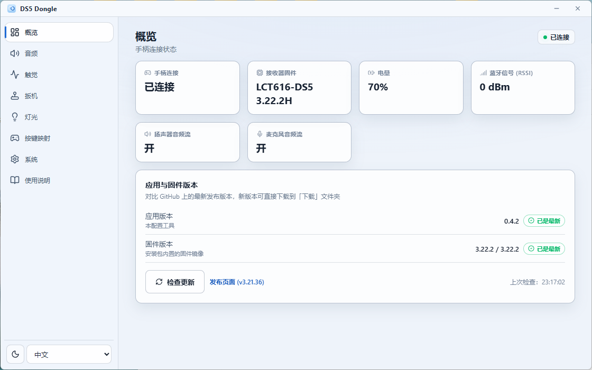
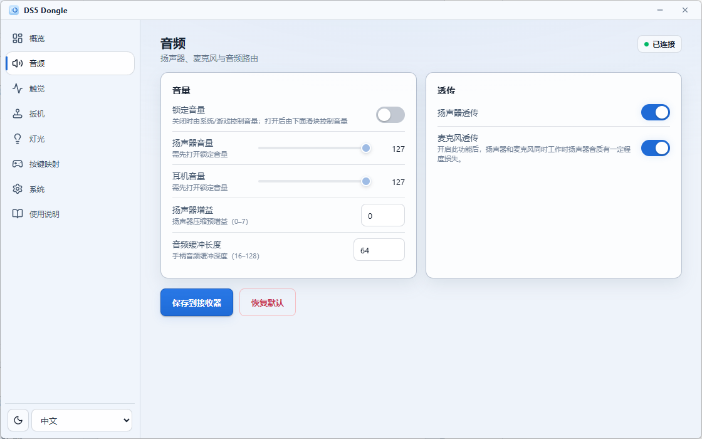
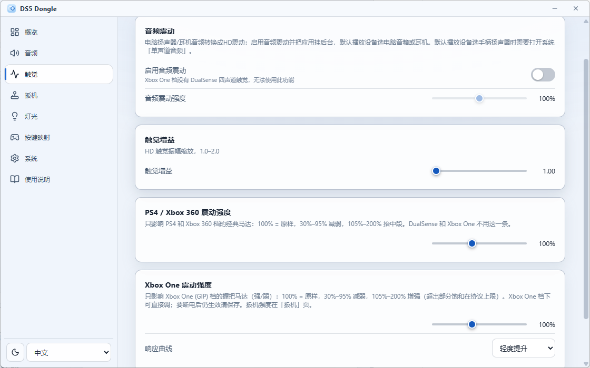
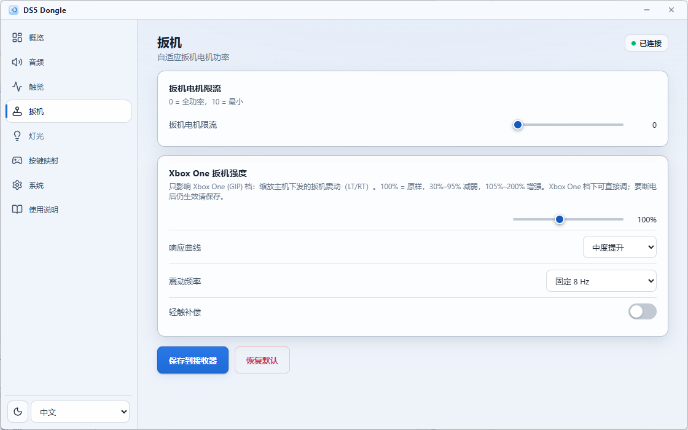
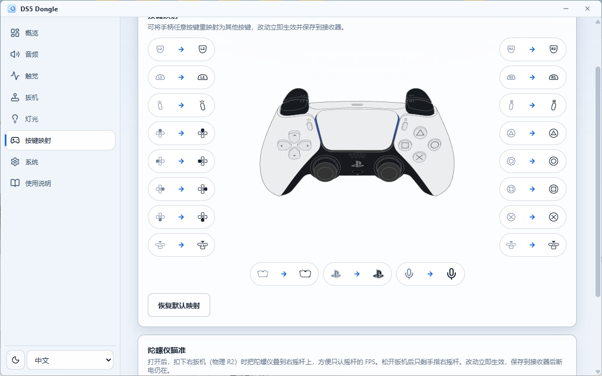
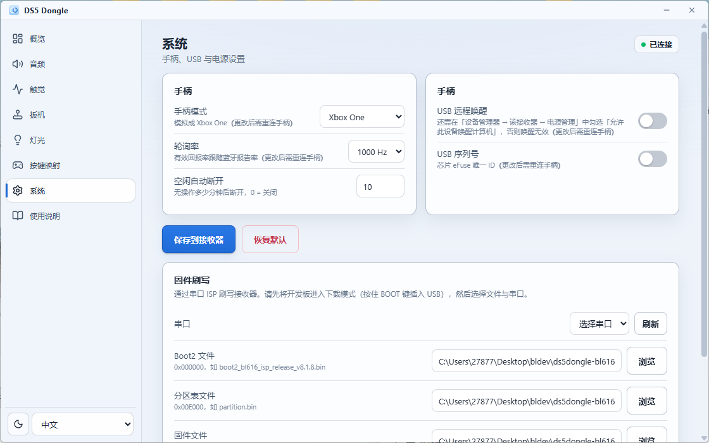
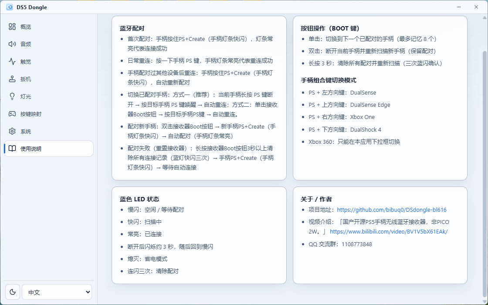

# DS5Dongle BL618 (DS5 Dongle)

> **中文**：[README.md](README.md)

A wireless DualSense controller adapter firmware for the **LCTech BL616** board. It bridges a DualSense or DualSense Edge gamepad over Bluetooth Classic (BR/EDR) HID to a host PC over USB, with **five host-side personas**: **DualSense** (VID 054C / PID 0CE6), **DualSense Edge** (PID 0DF2), **DualShock 4** (PID 09CC), **Xbox One / Series** (GIP, host `xboxgip` stack) and **Xbox 360** (XUSB, VID 1209 / PID DB05). Fully compatible with Steam, SDL, PS Remote Play, and more.

> **Unofficial project** — not affiliated with or endorsed by Sony Interactive Entertainment. "DualSense", "DualSense Edge" and "PlayStation" are trademarks of Sony Interactive Entertainment. The USB VID/PID values (054C:0CE6 / 0DF2) are emulated so the host sees a standard wired controller; use at your own risk.

> This project is **only adapted for the LCTech BL616 board** (the firmware's `board_config.h` keeps compile options for other boards, but they are not validated on other hardware).

## Hardware Requirements

- **LCTech BL616** dev board (BL616 QFN32, native USB Type-C + on-board USB-UART bridge)
- **DualSense** controller (standard 0CE6) or **DualSense Edge** (0DF2, auto-detected)
- USB-C data cable (power + USB data)
- Optional serial debug: USB-TTL adapter (CH340/CH341, 3.3V)

## Features

- BT Classic HID Host: inquiry, SDP, L2CAP, SSP auto-pairing
- Full input passthrough: sticks, buttons, triggers, gyro, accelerometer, touchpad, battery
- Full output forwarding (host frames passed through, plus config overlay and the player-LED battery gauge): rumble, RGB light bar, player indicators, adaptive triggers
- Bidirectional audio: UAC1 4ch 48kHz OUT → Opus encode → BT 0x39 dual-frame report (547B, speaker/headset); BT mic Opus → decode → UAC1 2ch 48kHz IN
- HD haptics: USB Audio Ch2/Ch3 → 16:1 decimation → BT 0x92 haptic tag
- **Audio haptics**: with PC speakers/headphones as the default output, turn on **Audio vibration** in the companion (WASAPI loopback; the app must stay running; not available in the Xbox One persona, which has no 4-channel UAC). Hearing the **pad speaker** does not use that loopback — enable Windows **Mono audio** so the OS fills the haptic channels
- DualSense Edge support: auto-detect → unlock handshake → profile prefetch, PID auto-switch (0DF2)
- **Xbox 360 pad persona**: present as an Xbox 360 controller (XInput) so games recognise it natively. Audio and rumble are preserved; only adaptive triggers are unavailable (XInput has no trigger force feedback), and the light bar stays on the colour set in the app
- **DualShock 4 persona**: USB identity `054C:09CC`; input, touch, and rumble follow the wired DS4 layout (no PS4 host authentication)
- **Xbox One / Series pad persona (GIP)**: the PC sees an Xbox pad with **4-channel rumble including both triggers** (host LT/RT mapped onto the DS5 trigger actuators). This persona is **always full-speed** (at high speed the inbox driver plays headset audio at capture÷1000). Configuration uses an extra HID client (`045E:0B84`), so the companion can still change settings and remaps. Motor/trigger strength (30–200%) can be saved in this persona or another
- **Controller combo for switching personas**: hold **PS + a D-pad direction** — Left = DualSense, Up = DualSense Edge, Right = Xbox One (GIP), Down = DualShock 4. Saved to flash, then reboot. **Xbox 360 is app-dropdown only.** The combo is Bluetooth, so it works from any USB persona, including GIP
- Multi-controller memory: up to 8 paired controllers, single click to switch
- Robust reconnection: periodic scan retry, connection watchdog, link supervision timeout, stale ACL cleanup
- Idle timeout: configurable 0–60 min auto-disconnect (default 30 min)
- Polling rate: 250 Hz / 500 Hz; high-speed firmware also offers 1000 Hz. Effective report rate follows Bluetooth. Full-speed firmware has no 1000 Hz option
- **Gyro aim**: while physical R2 is held, yaw/pitch are added onto the right stick (sensitivity 10–200%)
- Button remap including all four D-pad directions (19 remappable inputs)
- USB remote wakeup, USB serial (eFuse), trigger motor reduction, volume lock, LED auto-off, player-LED battery gauge (0-10% 1 / 20-40% 2 / 50-70% 3 / 80-100% 4 LEDs; the gauge is skipped while the level is unknown)
- Multilingual Windows companion app: Simplified Chinese / English, dark / light themes

### Windows Companion App (DS5 Dongle)

The `companion/` directory holds an Electron + React Windows configuration tool. DualSense / Edge / DualShock 4 / Xbox 360 use WinUSB vendor requests (0xF6–0xF9 / 0xFB); **Xbox One (GIP)** uses the HID config channel with the same payloads.

- Config pages: audio (including audio vibration), haptics, triggers, lighting, button remapping (including gyro aim), system (controller mode / polling rate / idle timeout / USB wakeup / USB serial)
- Visual remapping: original DualSense art + button glyphs, changes apply and persist instantly
- Firmware flashing: ships BLFlashCommand + default firmware inside the installer — flash over serial ISP without the SDK
- Live status: controller connection state (auto-detect disconnect), battery / RSSI / firmware version
- Versions and updates: the Overview page shows the app version and the firmware version bundled in the installer, and can check GitHub for a newer release and download it straight to your Downloads folder

**Screenshots:**

<p align="center">
  
  <br><em>Overview: connection / battery / RSSI / version updates</em>
</p>

<p align="center">
  
  <br><em>Audio: volume lock, gain, buffer, passthrough</em>
</p>

<p align="center">
  
  <br><em>Haptics: audio vibration, gain, DualShock 4 / Xbox rumble strength</em>
</p>

<p align="center">
  
  <br><em>Triggers: motor reduction, Xbox One trigger rumble</em>
</p>

<p align="center">
  
  <br><em>Button remapping: controller art + glyphs, including gyro aim</em>
</p>

<p align="center">
  
  <br><em>System: mode / polling rate / USB / firmware flashing</em>
</p>

<p align="center">
  
  <br><em>Help: pairing, persona combos, LED and BOOT button</em>
</p>

## Controller Feature Compatibility

The USB side defaults to DualSense-compatible HID descriptors (auto-switching between DS and Edge); it can also present as DualShock 4, Xbox One (GIP), or Xbox 360 (XUSB). The table below describes the **DualSense persona** — see the feature list above for the others.

| Feature | Data Path | Supported |
|---------|-----------|-----------|
| Sticks / Buttons / Triggers | HID Input passthrough | Yes |
| Gyro / Accelerometer | HID Input passthrough | Yes |
| Touchpad | HID Input passthrough | Yes |
| Battery level | HID Input passthrough | Yes (battery reported to the app via feature 0xF9; no on-board LED alert) |
| **Adaptive triggers** | HID Output SetStateData | Yes |
| **Rumble** | HID Output SetStateData | Yes |
| RGB light bar / Player LEDs | HID Output SetStateData | Yes |
| **HD haptics** | USB Audio Ch2/Ch3 → BT 0x92 | Yes |
| Controller speaker | USB Audio Ch0/Ch1 → Opus → BT 0x39 tag 0x93 | Yes |
| Controller microphone | BT Input → Opus decode → USB Audio IN | Yes |
| 3.5mm headset (output) | USB Audio → Opus → BT 0x39 tag 0x96 | Yes |
| Mic mute LED | BT Input mute button → MuteLight control | Yes |

## LED Status Indicators (LCTech BL616 single blue LED)

| State | Pattern |
|-------|---------|
| Idle / waiting to pair | Slow blink (~1Hz) |
| Scanning | Fast blink (~3Hz) |
| Connected | Solid |
| Just disconnected | Blink (~1Hz) for ~3s, then back to idle slow blink |
| Auto-off | Off after 1 minute (on by default) |
| Event acknowledge | Single flash |
| Bonds cleared | Triple flash |

### BOOT Button Gestures

| Gesture | Action |
|---------|--------|
| Single click | Switch to the next paired controller (up to 8 remembered) |
| Double click | Disconnect current controller + scan for a new one (link keys preserved) |
| Hold 3s | Clear all bonds + start scanning (triple LED flash to confirm) |

## Quick Start

### 1. Bouffalo SDK (DS5Dongle fork — required)

```bash
git clone https://github.com/sqlCRT/bouffalo_sdk.git bouffalo_sdk
```

The build script expects the SDK in `../bouffalo_sdk` (a sibling directory of this repository).

### 2. Dependencies and Toolchain

- macOS/Linux: `brew install cmake make` (or `apt install cmake make`)
- RISC-V toolchain must be the **T-Head extended** build (standard `riscv64-elf-gcc` does not work); macOS uses a community prebuilt toolchain, Linux uses the SDK-bundled or T-Head official toolchain
- Windows: T-Head Windows toolchain + the bundled `build_windows.bat`

### 3. Build (LCTech BL616)

```bash
# macOS / Linux
bash build_macos.sh build      # incremental
bash build_macos.sh rebuild    # clean + rebuild
bash build_lctech616.sh rebuild
```

```bat
rem Windows
build_windows.bat rebuild
```

Output: `firmware/lctech616/ds5dongle-lctech616-<fwVersion>.bin` (~800 KB) plus `boot2_bl616_isp_release_v8.1.8.bin`, `partition.bin` and `flash_prog_cfg.ini`.

> **The file name carries the firmware version**: the version is the last segment before the extension, the same
> rule the companion installer follows (`DS5-Dongle-Setup-<appVersion>.exe`) — e.g. `ds5dongle-lctech616-3.22.2.bin`
> and `ds5dongle-lctech616-hs-3.22.2.bin`. The variant lives in `-hs` only, so both images share one version number
> (the images still embed their own `H` marker internally). The build script reads the version out of the image it just linked
> (the image embeds `LCT616-DS5 x.y.z`), so nothing has to be kept in sync by hand. The companion app's
> "check for updates" reads versions from file names the same way — **keep these names unchanged when uploading to
> a GitHub release**.

## Flashing

**One-click flashing from the companion app (Windows)** — the flash tool and the default firmware are bundled in the installer, so no SDK and no Dev Cube are needed:

1. Hold the **BOOT** button on the LCTech BL616, then plug the board into the PC via USB-C, keeping BOOT held until it enters UART (ISP) download mode.
2. Open the companion app → System → Firmware Flashing, click Refresh and pick the board's COM port.
3. The three files are filled in for you (Boot2 `0x000000`, partition `0x00E000`, firmware `0x010000`); use Browse to pick the other `.bin` when you want a different firmware build.
4. Click Flash firmware.

> Flashing only uses the bin files in `firmware/lctech616/`: `boot2_bl616_isp_release_v8.1.8.bin`, `partition.bin`,
> and either `ds5dongle-lctech616-<fwVersion>.bin` or `ds5dongle-lctech616-hs-<fwVersion>.bin` (full-speed / high-speed).
> Running from source, the app reads that directory; from an installed build it reads `<install>\resources\firmware\`,
> which is copied from there at packaging time.

## Usage

1. Connect the LCTech BL616 board's Type-C port to the target host (power + USB data)
2. Put the controller in pairing mode (hold **PS + Create** for 3 seconds, light bar flashes)
3. Watch the on-board blue LED for status (see LED table above)
4. The host should see "DualSense Wireless Controller"

## Configuration

Settings persist via `bt_settings` and are read/written as 0xF6–0xF9 / 0xFB over WinUSB or GIP HID, changeable from the companion without rebuilding. Highlights (defaults):

| Option | Default |
|--------|---------|
| Controller mode | Auto (DualSense / Edge / DualShock 4 / Xbox One / Xbox 360) |
| Polling rate | 250 Hz (250 / 500; high-speed firmware also has 1000 Hz) |
| Idle auto-disconnect | 30 min (0–60, 0 = off) |
| LED auto-off | On (after 1 min) |
| Custom light-bar color | White |
| USB serial number | Off |
| USB remote wakeup | Off |
| Haptics gain | 1.0 (1.0–2.0) |
| Xbox motor strength | 100% (30–200%, GIP persona only; plus a 4-step response curve) |
| Xbox trigger strength | 100% (30–200%, GIP persona only; plus response curve, frequency, light-touch) |
| Trigger motor reduction | 0 (0–10) |
| Volume lock | Off |
| Mic / speaker passthrough | On |
| Gyro aim | Off (sensitivity 100%) |
| DualShock 4 / Xbox 360 classic motor strength | 100% (30–200%) |

### Switching controller mode

**The controller combo works from any persona**, including Xbox One:

| Combo (hold PS, then press) | Switches to |
|---|---|
| **PS + D-pad Left** | DualSense |
| **PS + D-pad Up** | DualSense Edge |
| **PS + D-pad Right** | Xbox One (GIP) |
| **PS + D-pad Down** | DualShock 4 |

It fires once per PS hold; the firmware saves to flash and reboots. **Xbox 360 is app-dropdown only.**

**The app dropdown works too** (including Xbox 360): change it, then **Save to dongle**. If controller mode / polling rate / USB remote wakeup / USB serial number changed, the firmware saves and **re-enumerates itself** — no replug. That restart drops Bluetooth, so **press PS once to reconnect**. The companion can still reach Xbox One over the HID config channel.

## Project Structure

```
src/
├── main.c              Entry + FreeRTOS tasks + output passthrough + data bridge
├── bt_hid_host.c/h     BT Classic HID Host (Inquiry + SDP + L2CAP + SSP)
├── ds5_protocol.c/h    DualSense protocol definitions + CRC32
├── usb_gamepad.c/h     USB composite device + persona descriptors / switching
├── gip.c/h             Xbox One / Series (GIP: handshake, input, rumble, headset, HID config)
├── xinput.c/h          Xbox 360 (XUSB) input mapping
├── ds4.c/h             DualShock 4 USB input/output mapping
├── gyro_aim.c/h        Gyro aim (add onto right stick while physical R2 is held)
├── ds5_usb_audio.c/h   USB Audio Class 1 (4ch 48kHz ISO OUT + 2ch 48kHz ISO IN)
├── audio.c/h           Audio pipeline (sinc resample + Opus encode/decode + haptics + mic)
├── usb_wake.c/h        USB remote wakeup FSM
├── state_mgr.c/h       SetStateData state management (primer / volume sync / volume lock)
├── config.c/h          Configuration system (bt_settings + 0xF6-0xF9)
├── dse.c/h             DualSense Edge profile management
├── remap.c/h           Button remap (incl. D-pad directions, 19 keys)
├── led_status.c/h      LED status indicator (LCTech BL616 single blue LED)
├── board_config.h      Board abstraction
├── debug_log.h         Build-time log level macros (LOG_ERR/WRN/INF/DBG/ISR)
└── FreeRTOSConfig.h    FreeRTOS configuration
lib/
├── opus/               Opus codec (fixed-point, xiph/opus)
├── opus.cmake          Opus source file list
└── opus_config.h       Opus build configuration
companion/              Windows companion app (Electron + React, see section above)
firmware/               Local build output (binaries and generated flash_prog_cfg.ini are git-ignored)
```

## Architecture

```
┌──────────────┐          ┌──────────────┐          ┌──────────────┐
│  DualSense   │◄─ BT ──►│ LCTech BL616  │◄─ USB ──►│   Host PC    │
│  Controller  │  BR/EDR  │   DS5 Dongle │  HID     │  Steam/SDL   │
└──────────────┘  HID     └──────────────┘  Device   └──────────────┘
```

**Data flows:**

- **Input (Controller → Host)**: BT L2CAP receives Report 0x31 → strip HID header/seq/CRC → 63-byte payload sent as USB Report 0x01
- **Output (Host → Controller)**: USB EP OUT receives host output → passed through (config overlay + player-LED battery gauge) → BT Report 0x31 (78B with CRC32) → L2CAP send
- **Audio OUT (Host → Controller)**: USB Audio ISO OUT (4ch 48kHz) → double-buffer PCM accumulation → polyphase sinc resample 512→480 → Opus CBR encode (160kbps, **mono by default; the encoder is re-initialised to stereo when a 3.5mm headset is plugged in**) → haptics decimation → 0x39 dual-frame report (547B) → L2CAP send
  - Silence detection: the host keeps the audio endpoint open and streams zeros whenever nothing is playing, so a pre-encoded silence frame is reused instead of running the encoder
- **Audio IN (Controller → Host)**: BT 0x31 mic Opus frame → queue → Opus decode (48kHz mono) → mono-to-stereo → ring buffer → USB Audio ISO IN (2ch 48kHz)
- **Feature (bidirectional)**: GET_REPORT from BT-side cache (DSE profiles support NAK gating) | SET_REPORT adds CRC32 and forwards via L2CAP control channel

## Known Limitations

| Item | Description |
|------|-------------|
| Single active controller | One controller connected at a time; up to 8 pairings remembered (single click switches) |
| Board | Only the LCTech BL616 is adapted and validated |
| Bidirectional audio CPU | On the single 320MHz core, Opus encode+decode already consume **~89%** of the report cycle (encode 5.6ms x2 + decode 3.6ms x2.13 / 21.33ms). Bidirectional 48kHz audio is effectively this chip's ceiling -- anything added to the audio path has to shrink that budget first |

## Acknowledgements

- [sqlCRT/ds5dongle-bl618-opensource](https://github.com/sqlCRT/ds5dongle-bl618-opensource) — source of this open-source firmware release
- [SundayMoments/DS5_Bridge](https://github.com/SundayMoments/DS5_Bridge) — source of the Windows companion app (`companion/`, button glyphs, controller art and UI design)
- [awalol/DS5Dongle](https://github.com/awalol/DS5Dongle) — original Pico 2W implementation, core protocol reference
- [bouffalolab/bouffalo_sdk](https://github.com/bouffalolab/bouffalo_sdk) — BL618 SDK + Zephyr BT stack
- [CherryUSB](https://github.com/cherry-embedded/CherryUSB) — USB stack
- [xiph/opus](https://github.com/xiph/opus) — Opus audio codec (fixed-point)
- Linux kernel `hid-playstation.c` — DualSense protocol offset reference
- BL618 porting developed with [Cursor](https://www.cursor.com/) + Claude Opus 4.6

## Third-Party Notices

- Code is ported/adapted from [awalol/DS5Dongle](https://github.com/awalol/DS5Dongle), licensed under the MIT License (Copyright (c) 2026 awalol) — see [NOTICE](NOTICE) for the full text
- The Windows companion app is ported/adapted from [SundayMoments/DS5_Bridge](https://github.com/SundayMoments/DS5_Bridge), licensed under AGPL-3.0-only
- [lib/opus](lib/opus) is the [xiph/opus](https://github.com/xiph/opus) codec, BSD-3-Clause licensed (see `lib/opus/LICENSE_PLEASE_READ.txt`)
- [CherryUSB](https://github.com/cherry-embedded/CherryUSB) and [bouffalolab/bouffalo_sdk](https://github.com/bouffalolab/bouffalo_sdk) are external build dependencies, Apache-2.0 licensed
- The Linux kernel `hid-playstation.c` (GPL-2.0) was used as a protocol/offset reference only; no kernel code is included

## License

This project is licensed under the [GNU General Public License v3.0](LICENSE) (GPL-3.0). Anyone who uses or modifies this code in a distributed product must make their source code available under the same license.
